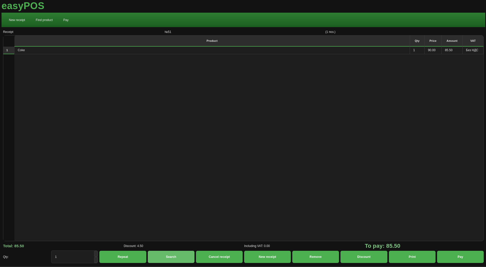

# easyPOS

A desktop Point of Sale (POS) application built with Qt 6. It provides sales, inventory, production, shifts, reports, and role-based access control.

## Screenshot



## Features

- **Authentication & RBAC** — Login, signup, role-based access control (AuthManager, AccountManager, RoleManager)
- **Setup wizard** — First-run setup: database connection, branding (logo, address, legal info), admin account
- **Goods & categories** — Product catalog with categories, VAT rates, and services
- **Sales** — Check creation, discounts, payments, check history, PDF/export
- **Stock** — Stock management and balance views
- **Production** — Recipes and production runs
- **Shifts** — Shift management
- **Reports** — Sales and other reports; export to CSV and ODT
- **Alerts** — Configurable alerts
- **Employees & positions** — Staff and role management
- **Promotions** — Promotion management
- **Localization** — Russian and English (Qt Linguist)
- **Theming** — Light and dark “green” theme (follows system color scheme on Qt 6.5+)

## Requirements

- **CMake** 3.19 or later
- **Qt 6.4** or later (Core, Widgets, Sql, PrintSupport, Test, LinguistTools)
- C++17-capable compiler

## Build

1. Set Qt path (if CMake does not find it):

   ```bash
   export CMAKE_PREFIX_PATH=/path/to/Qt/6.x/gcc_64   # Linux
   # or
   set CMAKE_PREFIX_PATH=C:\Qt\6.x\msvc2019_64       # Windows
   ```

   The project also tries common locations under `$HOME/Qt/` (e.g. `6.4.2/gcc_64`, `6.8.3/gcc_64`).

2. Configure and build:

   ```bash
   mkdir build && cd build
   cmake ..
   cmake --build .
   ```

3. Run the application:

   ```bash
   ./easyPOS          # Linux/macOS
   easyPOS.exe        # Windows
   ```

## Tests

Unit tests are built with the main project. Run them from the build directory:

```bash
ctest
# or
./unit_tests
```

Tests cover DatabaseConnection, AuthManager, AccountManager, RoleManager, StockManager, SalesManager, SettingsManager, ShiftManager, AlertsManager, ReportManager, ProductionManager, EasyPOSCore, CategoryManager (goods), PositionManager, EmployeeManager, and PromotionManager.

Tests that need a database (Auth, Account, Role, Stock, Sales) use connection settings from environment variables, with defaults for a local test DB:

| Variable | Default |
|----------|---------|
| `EASYPOS_TEST_DB_HOST` | `192.168.0.202` |
| `EASYPOS_TEST_DB_PORT` | `5432` |
| `EASYPOS_TEST_DB_NAME` | `pos_bakery` |
| `EASYPOS_TEST_DB_USER` | `postgres` |
| `EASYPOS_TEST_DB_PASSWORD` | `123456` |
| `EASYPOS_TEST_DB_SSL` | `prefer` |
| `EASYPOS_TEST_DB_TIMEOUT` | `10` |

If the database is unavailable, those tests are skipped (QSKIP). DatabaseConnection and SettingsManager tests do not require a running database.

## Install

From the build directory:

```bash
 cmake --install .
```

Executable is installed to the standard bin directory; translations (`.qm` files) go to `share/easyPOS/i18n`.

## Project structure

- `main.cpp` — Entry point, translation and theme setup, setup wizard and auth flow
- `easyposcore.h/cpp` — Core facade: DB connection, managers, branding
- `db/` — Database connection and structures
- `RBAC/` — Auth, accounts, roles
- `ui/` — Qt widgets and dialogs (auth, setup, goods, sales, reports, etc.)
- `sales/` — Sales and stock managers
- `production/` — Production/recipes
- `shifts/` — Shift manager
- `reports/` — Report data and exporters (CSV, ODT)
- `alerts/` — Alerts manager
- `settings/` — Settings manager
- `promotions/` — Promotions
- `employees/` — Employees and positions
- `goods/` — Categories and catalog
- `logging/` — Log manager
- `unit_tests/` — Unit tests

## License

See repository or project files for license information.
